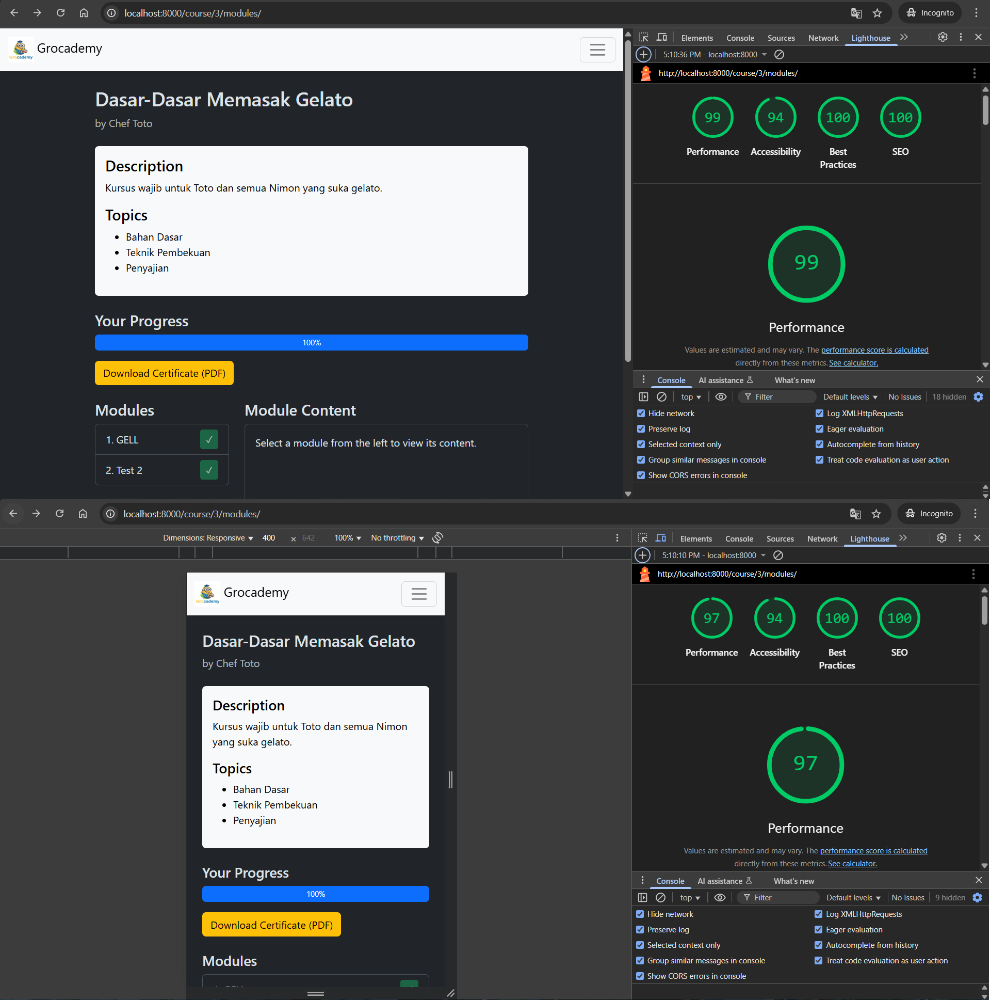
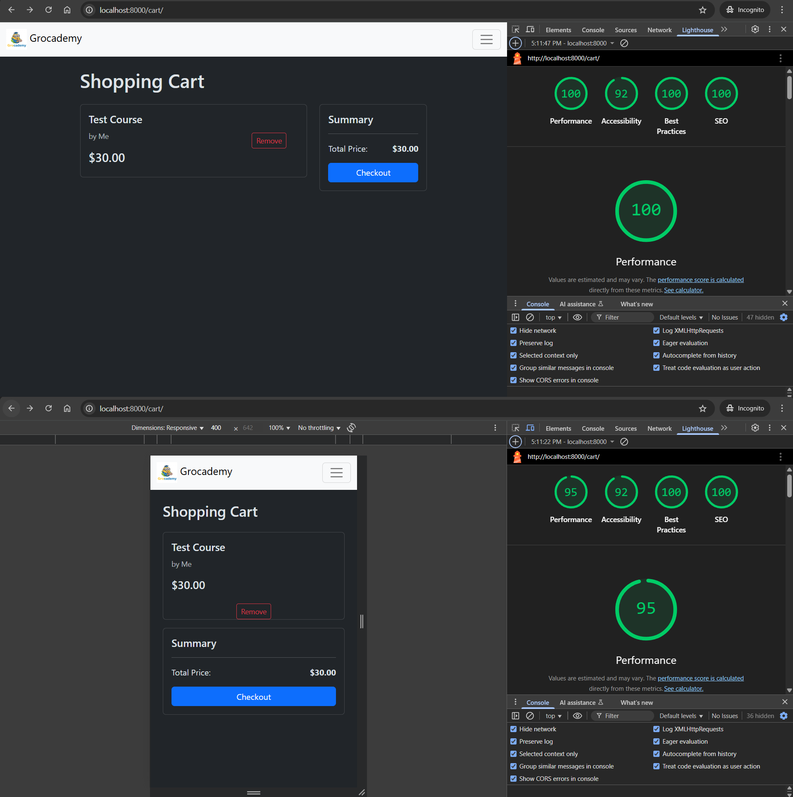

# Website Monolith Grocademy

## Author
Nama: Rasyid Rizky Susilo Nurdwiputro
 
NIM: 18223114

## Setup
**Requirement**
1. Docker Desktop

**How to use**
1. `git clone https://github.com/rasyidrizky/Website-Grocademy.git`
2. `cd Website-Grocademy/grocademy`
3. `docker-compose up --build`
4. `http://localhost:8000` (user), `http://localhost:8000/admin` (admin)

**Additional**
- `docker-compose exec web python manage.py createsuperuser` (bikin akun admin)

## Design Pattern
1. **Model-View-Template (MVT)**

MVT pada proyek ini didasarkan pada pola arsitektur yang secara native digunakan oleh framework Django. Pola ini memisahkan aplikasi ke dalam tiga komponen utama: Model yang mendefinisikan struktur tabel serta logika bisnis, View yang menangani permintaan HTTP dan menghubungkan data dengan presentasi, serta Template yang menyajikan data kepada pengguna. Pemanfaatan pola ini memastikan struktur kode yang lebih terorganisir, modular, dan mudah dipelihara seiring perkembangan aplikasi.

2. **Singleton**

Singleton Pattern diterapkan secara implisit pada beberapa komponen, salah satunya objek Settings yang setiap kali dilakukan pemanggilan `from django.conf import settings`, yang diperoleh selalu instance yang sama. Penerapan pola ini memungkinkan manajemen state dan konfigurasi global yang terpusat serta konsisten sehingga setiap bagian aplikasi mengakses parameter yang identik tanpa redundansi objek maupun risiko inkonsistensi.

3. **Decorator**

Decorator Pattern merupakan pola perancangan yang memungkinkan penambahan fungsionalitas baru pada objek atau fungsi secara dinamis tanpa mengubah strukturnya. Pada proyek ini, penerapan Decorator Pattern terlihat melalui penggunaan dekorator Django, misalnya `@method_decorator(never_cache, name='dispatch')` pada kelas CourseDetailPageView di `courses/views_frontend.py`. Pola ini digunakan untuk membungkus view dengan perilaku tambahan agar halaman tidak disimpan di-cache sehingga fitur keamanan atau pengelolaan caching dapat ditambahkan secara modular tanpa mengubah logika utama view.

## Tech Stack
**Fondasi & Backend Utama**
- Bahasa: Python (3.11)
- Framework: Django (5.2.5)
- Framework REST API: Django REST Framework (3.16.1)
- Server Produksi: Gunicorn (23.0.0)

**Manajemen Data & Database**
- Database: PostgreSQL (16)
- ORM: Django ORM (Bawaan Django)
- Migrasi Database: Django Migrations (Bawaan Django)
- Driver Database: psycopg2-binary (2.9.10)
- Utility Koneksi Database: dj-database-url (3.0.1)

**Autentikasi & Keamanan**
- JWT (JSON Web Tokens): djangorestframework-simplejwt (5.5.1)
- Password Hashing: Django PBKDF2 Hasher (Bawaan Django)
- CORS Handling: django-cors-headers (4.7.0)

**Frontend (Monolitik)**
- Template Engine: Django Templates (Bawaan Django)
- Framework UI: Bootstrap (5.3.2)
- Pustaka Ikon: Bootstrap Icons (1.11.3)
- Interaktivitas: Vanilla JavaScript (ES6+)

**Fitur & Perkakas Tambahan**
- Dokumentasi API: drf-spectacular (0.28.0)
- Pembuatan PDF: WeasyPrint (66.0)
- Penyajian File Statis (Produksi): whitenoise (6.9.0)

**Lingkungan & Perkakas Development**
- Containerization: Docker & Docker Compose
- Variabel Lingkungan (Lokal): python-dotenv (1.1.1)

**Platform & Layanan Deployment**
- Platform Aplikasi: Fly.io
- Platform Database: Neon.tech

## Endpoint
**GET**
- `/api/courses/` : Endpoint untuk melihat daftar semua kursus yang tersedia, dengan paginasi dan pencarian.
- `/api/courses/my-courses/` : Endpoint untuk melihat daftar kursus yang telah dibeli oleh pengguna yang sedang login.
- `/api/courses/{id}/` : Endpoint untuk melihat detail dari satu kursus spesifik.
- `/api/courses/{course_id}/modules/` : Endpoint untuk melihat daftar modul dari sebuah kursus yang telah dibeli.
- `/api/modules/{id}/` : Endpoint untuk melihat detail dari satu modul spesifik (hanya untuk admin).
- `/api/auth/self/` : Endpoint untuk mendapatkan informasi detail dari pengguna yang sedang login.
- `/api/users/` : Endpoint untuk melihat daftar semua pengguna, dengan paginasi dan pencarian dari sisi admin.
- `/api/users/{id}/` : Endpoint untuk melihat detail dari satu pengguna spesifik dari sisi admin.
- `/api/cart/` : Endpoint untuk melihat isi keranjang belanja pengguna yang sedang login.
- `/api/history/` : Endpoint untuk melihat riwayat pembelian pengguna yang sedang login.
- `/api/schema/swagger-ui/` : Endpoint untuk menampilkan halaman dokumentasi API interaktif.

**POST**
- `/api/courses/` : Endpoint untuk membuat sebuah kursus baru dari sisi admin.
- `/api/modules/` : Endpoint untuk membuat sebuah modul baru untuk sebuah kursus dari sisi admin.
- `/api/auth/register/` : Endpoint untuk mendaftarkan seorang pengguna baru.
- `/api/auth/login/` : Endpoint untuk melakukan login untuk mendapatkan token JWT dan sesi.
- `/api/users/{id}/balance/` : Endpoint untuk menambah (atau mengurangi dengan nilai negatif) saldo seorang pengguna dari sisi admin.
- `/api/cart/` : Endpoint untuk menambahkan sebuah kursus ke dalam keranjang belanja.
- `/api/cart/checkout/` : Endpoint untuk memproses semua item di keranjang untuk dibeli.
- `/api/modules/{id}/complete/` : Endpoint menandai sebuah modul sebagai "selesai".

**PUT**
- `/api/courses/{id}/` : Endpoint untuk memperbarui semua informasi dari sebuah kursus dari sisi admin.
- `/api/modules/{id}/` : Endpoint untuk memperbarui semua informasi dari sebuah modul dari sisi admin.
- `/api/users/{id}/` : Endpoint untuk memperbarui informasi seorang pengguna dari sisi admin.

**DELETE**
- `/api/courses/{id}/` : Endpoint untuk menghapus sebuah kursus dari sisi admin.
- `/api/modules/{id}/` : Endpoint untuk menghapus sebuah modul dari sisi admin.
- `/api/users/{id}/` : Endpoint untuk menghapus seorang pengguna dari sisi admin.
- `/api/cart/items/{item_id}/` : Endpoint untuk menghapus satu item dari keranjang belanja.

## Bonus
**B01 - OWASP**
 
Aplikasi ini diuji terhadap 3 celah keamanan umum dari OWASP Top 10 2021:
1. **A01:2021 – Broken Access Control**: Pengguna yang tidak terautentikasi secara otomatis dialihkan ketika mencoba mengakses halaman yang dilindungi, seperti modul, sehingga kontrol akses server terbukti berjalan efektif.
2. **A05:2021 – Security Misconfiguration**: Mode DEBUG dinonaktifkan pada lingkungan produksi yang dibuktikan dengan perbedaan tampilan halaman error antara server lokal (menampilkan detail debug) dan server produksi (menampilkan pesan umum) sehingga mencegah kebocoran informasi teknis.
3. **A07:2021 – Identification and Authentication Failures**: Web menerapkan kebijakan kata sandi yang kuat dengan menolak password yang terlalu pendek dan menolak username & email yang sudah terdaftar. Validasi ini dilakukan langsung oleh backend sehingga memperkuat sistem otentikasi pengguna.

Link Simulasi: https://drive.google.com/file/d/1DSHNZmFzc7AI-7YzuGRlb5GhVPAZC4fH/view?usp=sharing

**B02 - Deployment**
 
Aplikasi ini telah berhasil di-deploy dan berjalan secara live.
- **Platform Aplikasi**: Fly.io
- **Platform Database**: Neon.tech (PostgreSQL)
- **Link Aplikasi**: https://grocademy-floral-cloud-341.fly.dev/

**B03 - Polling**
 
Mekanisme short-polling bekerja dengan melakukan pengecekan berkala melalui endpoint ringan `/api/courses/count` yang mengembalikan jumlah total kursus saat ini. JavaScript di sisi klien menyimpan jumlah awal kursus, kemudian setiap 15 detik membandingkannya dengan data terbaru dari API. Jika terjadi perubahan, sistem menampilkan notifikasi dan secara otomatis memuat ulang halaman setelah lima detik guna menampilkan daftar kursus yang terkini.

**B05 - Lighthouse**

**Home Page**
 

**Login**
 

**Register**
 

**Course Detail**
 

**My Course**
 

**Module**
 

**Shopping Cart**
 

**Profile**
 

**History**
 

**B06 - Responsive Layout**
 
Seluruh tampilan frontend dibangun menggunakan Bootstrap 5 dengan pendekatan mobile-first sehingga layout aplikasi secara otomatis beradaptasi dan tetap terlihat tertata dengan baik di berbagai ukuran layar, mulai dari perangkat mobile hingga desktop.

**B07 - Dokumentasi API**
 
Dokumentasi REST API yang interaktif dan profesional telah dibuat menggunakan `drf-spectacular` untuk menghasilkan skema OpenAPI (Swagger UI).
- **Link Dokumentasi API**: https://grocademy-floral-cloud-341.fly.dev/api/schema/swagger-ui/

**B08 - SOLID**
- **Single Responsibility Principle (SRP)**
Dalam proyek ini, pemisahan peran telah jelas: `models.py` mendefinisikan struktur data, `views_...py` mengelola logika bisnis, `serializers.py` menangani transformasi data, dan `urls.py` mengatur routing. Dengan pembagian ini, perubahan pada satu aspek sistem tidak memengaruhi komponen lain sehingga kode lebih terstruktur dan mudah dipelihara.

- **Open/Closed Principle (OCP)**
Implementasi prinsip ini terlihat pada penggunaan class-based views, seperti CourseViewSet yang memperluas ModelViewSet dari Django REST Framework. Dengan cara ini, pengembang dapat menambahkan fungsionalitas baru, seperti permission classes atau custom actions, tanpa mengubah kode inti framework, sehingga stabilitas sistem tetap terjaga.

- **Liskov Substitution Principle (LSP)**
Model CustomUser yang diturunkan dari AbstractUser merupakan contoh penerapannya. Objek CustomUser dapat digunakan di seluruh mekanisme Django, seperti request.user atau LoginRequiredMixin, dengan tetap menjaga kompatibilitas penuh terhadap kontrak yang ditetapkan superclass.

- **Interface Segregation Principle (ISP)**
Penerapan ISP terlihat dalam penggunaan beberapa serializer berbeda untuk CustomUser, seperti RegisterSerializer, UserSerializer, dan AdminUserSerializer. Pemisahan ini memastikan bahwa setiap endpoint hanya mengakses data sesuai kebutuhan sehingga mengurangi ketergantungan berlebih dan meningkatkan keterbacaan kode.

- **Dependency Inversion Principle (DIP)**
Dalam proyek ini, views tidak bergantung langsung pada detail implementasi database, melainkan menggunakan Django ORM sebagai lapisan abstraksi. Dengan demikian, perubahan pada detail teknis, seperti penggantian PostgreSQL menjadi MySQL, tidak memerlukan penyesuaian pada kode view, sehingga tercipta arsitektur yang longgar (loosely coupled) dan fleksibel.

**B09 - Automated Testing**
 
Pengujian dilakukan dengan testing framework bawaan Django dan diukur menggunakan coverage.py, mencakup dua area utama: validasi model (misalnya pembuatan dan penyimpanan objek Course) serta pengujian keamanan API endpoint `/api/courses/` (akses ditolak bagi pengguna tidak terautentikasi dan berhasil bagi pengguna terautentikasi). Hasil pengujian menunjukkan coverage sebesar 68% sehingga memenuhi target minimal.

**B10 - Fitur Tambahan: Shopping Cart**
 
Aplikasi ini dilengkapi dengan fungsionalitas keranjang belanja yang lengkap, mencakup:
- Menambahkan beberapa kursus ke dalam keranjang.
- Melihat ringkasan isi keranjang di halaman cart.
- Melakukan checkout untuk semua item di keranjang sekaligus, dengan total pembayaran yang dihitung secara otomatis.
- Menampilkan riwayat transaksi pembelian yang detail.

## Screenshot
**Home Page**
 

**Login**
 

**Register**
 

**Course Detail**
 

**My Course**
 

**Module**
 

**Shopping Cart**
 

**Certificate**
 
